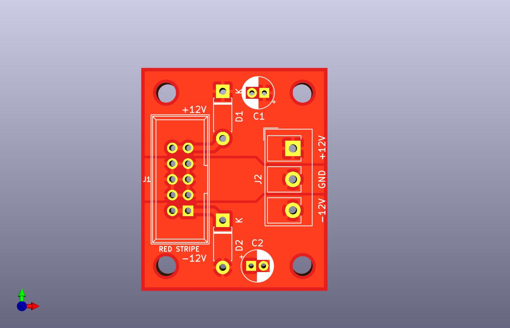
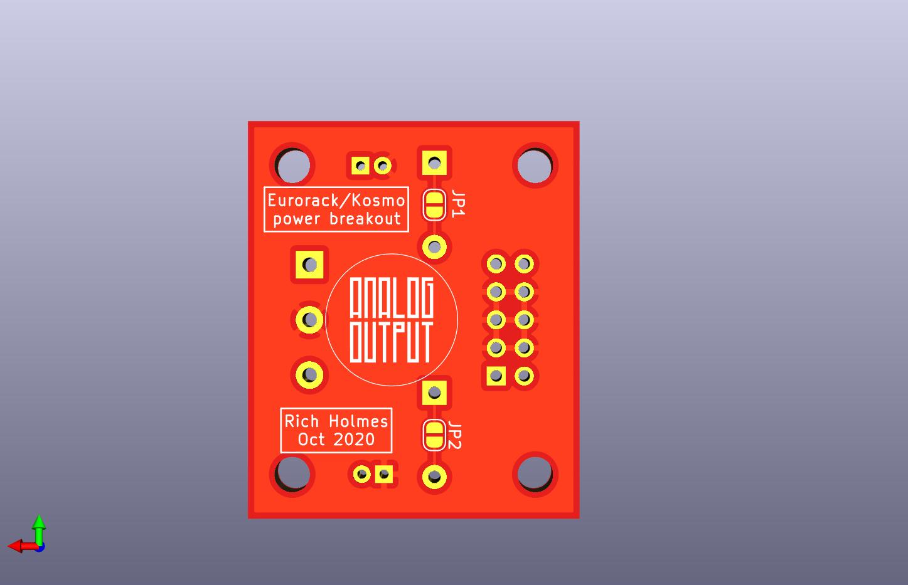

# Euro/Kosmo power breakout

A little board (30 x 36 mm) for connecting Eurorack or Kosmo power distribution systems to non Euro/Kosmo module PCBs. Footprints are provided for a 2x5 shrouded pin header to connect to the bus board, and a 3 pin terminal block to connect to the module PCB. (Of course one could instead solder wires to the terminal block pads.) Footprints are also provided for electrolytic capacitors from the rails to ground, and for Schottky diodes (or fuses or 10Ω resistors or ferrite beads or whatever you prefer) between the pin header and the rails, in case these are not provided for on the module PCB. If they are, the capacitors can be omitted and there are solder jumpers that can be filled to bypass the diode pads.

[Schematic, such as it is](Docs/powerbreakout.pdf) 

[BOM](Docs/powerbreakout_bom.md)
